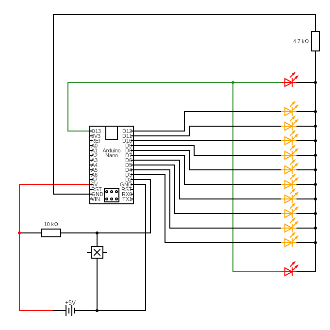

# POV Display

This project demonstrates a **Persistence of Vision (POV)** display that shows the text `"JAI HIND"` using 10 LEDs mounted on a rotating arm, controlled by an **Arduino Nano** and triggered by a **Hall effect sensor**.

---

## 📸 Circuit Diagram

---

## 🎥 Demo Video

<video src="https://user-images.githubusercontent.com/video/mipovdisplay.mp4" controls width="600"></video>

---

## 🧠 How it Works

- A Hall effect sensor detects the magnet on each rotation.
- Arduino triggers the LED pattern based on timing.
- The pattern is displayed column by column creating the illusion of full characters using POV.

---

## 🔧 Components Used

| Component            | Quantity | Description                                 |
|---------------------|----------|---------------------------------------------|
| Arduino Nano         | 1        | Controls the LED pattern                    |
| LEDs                | 10       | For POV pattern (D3–D12)                    |
| Always-on LED       | 1–2      | On D13, stays on for power indicator        |
| Hall Effect Sensor  | 1        | Detects rotation start (connected to D2)   |
| Resistors (330Ω)     | 10+      | For LED current limiting                    |
| Magnet              | 1        | Mounted on rotating object                  |
| Battery / USB       | 1        | Power supply                                |

---

## 💾 Arduino Code

The full code is available in the [code](code/) directory:  
[`pov_display.ino`](code/pov_display.ino)

---

## 📁 Folder Structure

